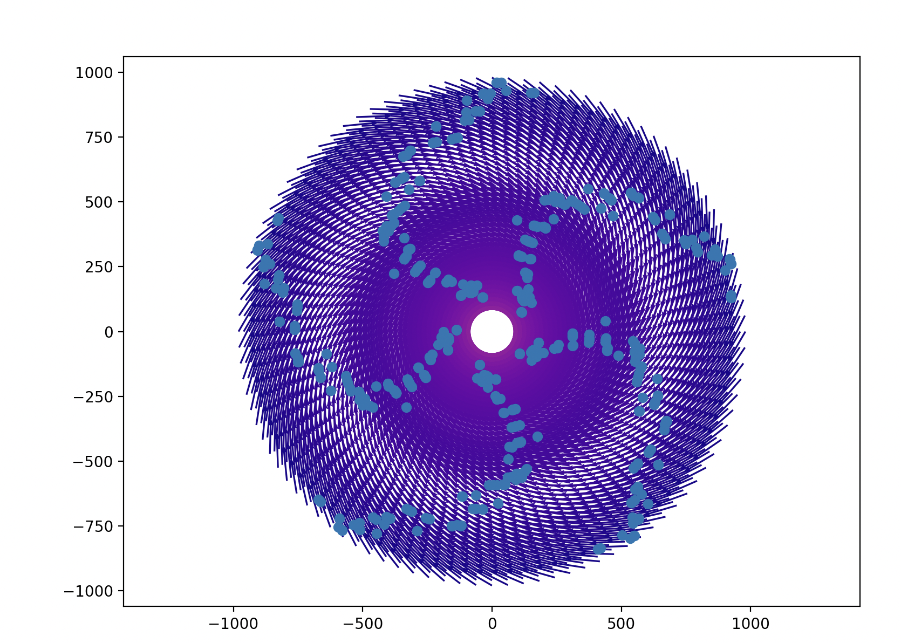

# HurricaneSim

A simulation of the bottom-most layer of a hurricane using fluid dynamics and Navier-Stokes equations. The code plots out an animated vector field with velocities and also some particles that follow the velocity field.

Simulated velocity field and particles of hurricane.
